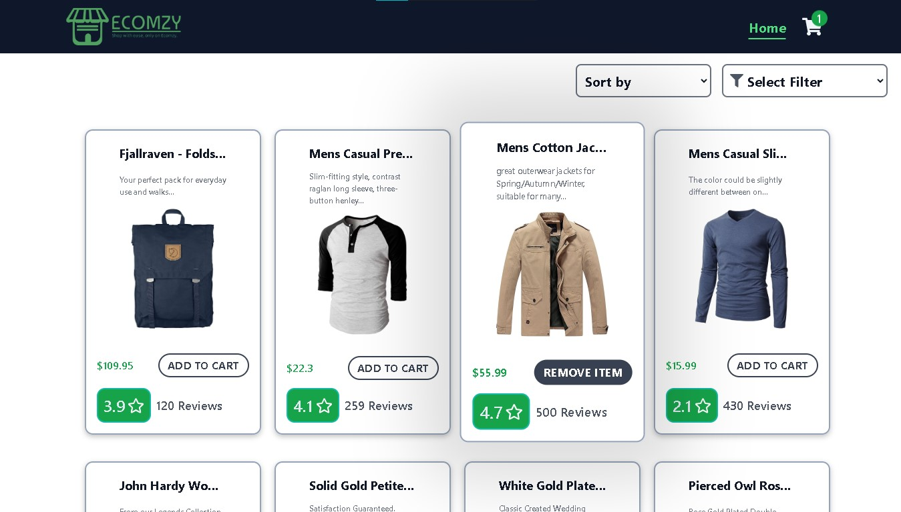
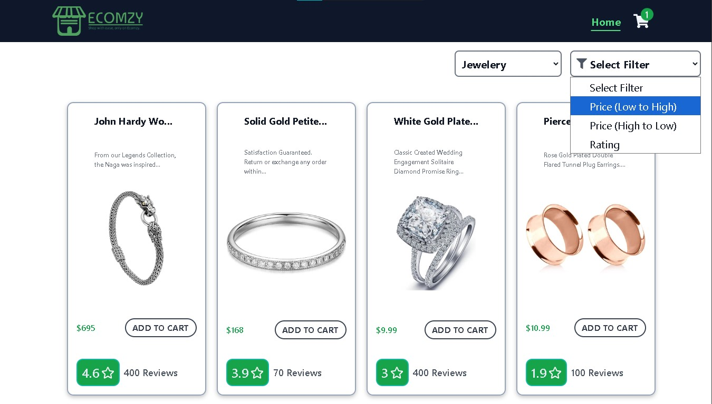
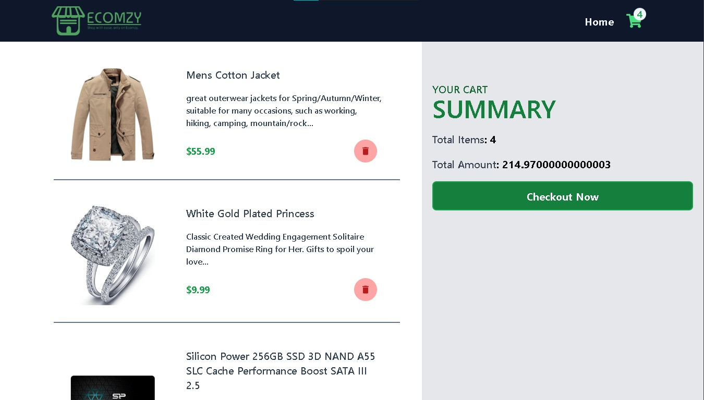
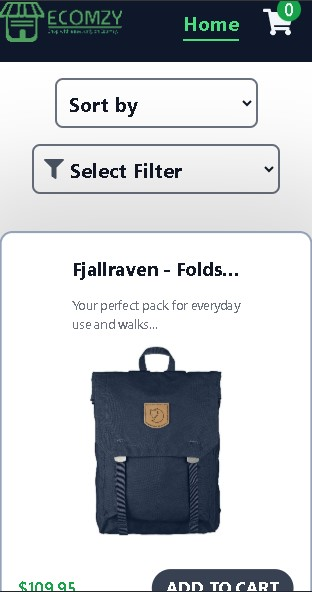

# ReactMart App

A feature-rich e-commerce web application built using **React.js** that allows users to browse and manage products with real-time data fetching from an external API. The app includes interactive sorting, filtering options, and a dynamic shopping cart for a seamless shopping experience.

## Live Demo
https://nayak-store.vercel.app/

## Features
- **Real-time Product Fetching**: Products are fetched dynamically from an external API and displayed in various categories (e.g., Men's Clothing, Women's Clothing, Electronics, Jewelry).

- **Sorting and Filtering**: Users can sort products by price, rating, and category, enabling an easy and customizable shopping experience.

- **Dynamic Cart Management**: Add/remove products from home page and remove items from the cart page, view the total price of all added items, and navigate between the home page and cart page.

- **Responsive UI**: The app is fully responsive, ensuring a smooth shopping experience on various devices.

- **React Router**: Implemented routing for seamless navigation between the Home and Cart pages.

## Tech Stack
- **React.js**: The core library used to build the app.
- **React Router**: For implementing routing between pages.
- **External API**: Used for fetching real-time product data.
- **Tailwind CSS3**: For styling and ensuring the app is responsive and user-friendly.

